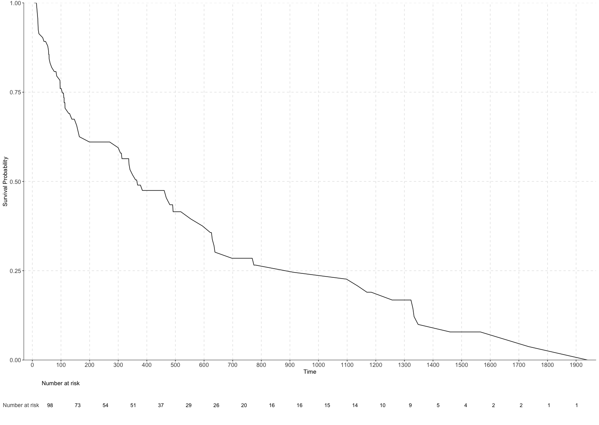

# CopulaGraphic
A package for Jo, J. H., Gao, Z., Jung, I., Song, S. Y., Ridder, G., & Moon, H. R. (2023). [Copula graphic estimation of the survival function with dependent censoring and its application to analysis of pancreatic cancer clinical trial](https://journals.sagepub.com/doi/10.1177/09622802231158812). Statistical Methods in Medical Research, 32(5), 944-962.

### Installation

```R
devtools::install_github("zhan-gao/CopulaGraphic")
```

### Example

```R
library(CopulaGraphic)
data(tau, d, rho) # simulated data
rw_out <- rw(
    tau,
    d,
    rho,
    alpha = 3.83,
    copula = "joe",
    quant_point = c(0.25, 0.5, 0.75),
    num_b = 10000,
    seed = 100
)
```

```R
# Estimated quantiles of survival times
print(rw_out$quant_time)
```

```
[1] 845.8924 366.0999 102.8447
```

```R
surv_plot(tau[rho == 1], rw_out$surv)
```


